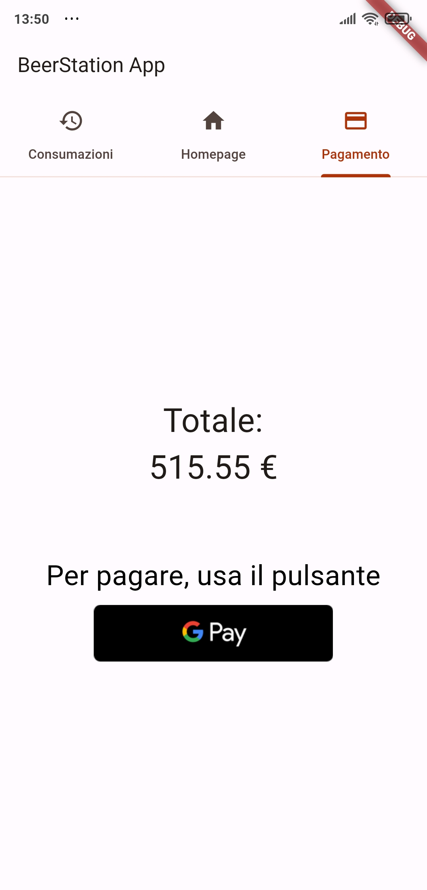

#  BeerStation

Project for my IoT's course @UniUD.

<div>
<a href='https://www.raspberrypi.com/'></a>
<a href='https://mqtt.org/'></a>
<a href=''></a>
<a href='https://www.python.org/'></a>
<a href='https://www.espressif.com/'></a>
<a href='https://www.mysql.com/it/'></a>
<a href='https://flutter.dev/'></a>
<a href='https://www.php.net/'></a>
</div>


This project I developed is my submission for my _Internet of Things'_ exam.

I tried to implement as many things as possible I've learned to use during the course and using the ESP programmable boards I've previously played with.

Arzon Francesco - 142439

## Folder Structure:

<details>
<summary>Brief tree folder view with the essential files</summary>

```
beerproject/
├─ API/
│  ├─ login.php
│  ├─ register.php
│  ├─ resetdebt.php
│  ├─ getconsumazioni.php
├─ DB/
│  ├─ TABLES/
│  │  ├─ create_tables.sql
│  │  ├─ ER model.mwb
├─ app/
│  ├─ beerstation/
│  │  ├─ lib/
│  │  │  ├─ obj/
│  │  │  │  ├─ consumazione.dart
│  │  │  │  ├─ user.dart
│  │  │  ├─ screens/
│  │  │  │  ├─ homepage.dart
│  │  │  ├─ users/
│  │  │  │  ├─ login_screen.dart
│  │  │  │  ├─ register_screen.dart
│  │  │  ├─ main.dart
│  │  │  ├─ utils.dart
├─ docs/
│  ├─ app_images/
│  ├─ icons/
```
</details>

## App Screenshots:

<div>


</div>
